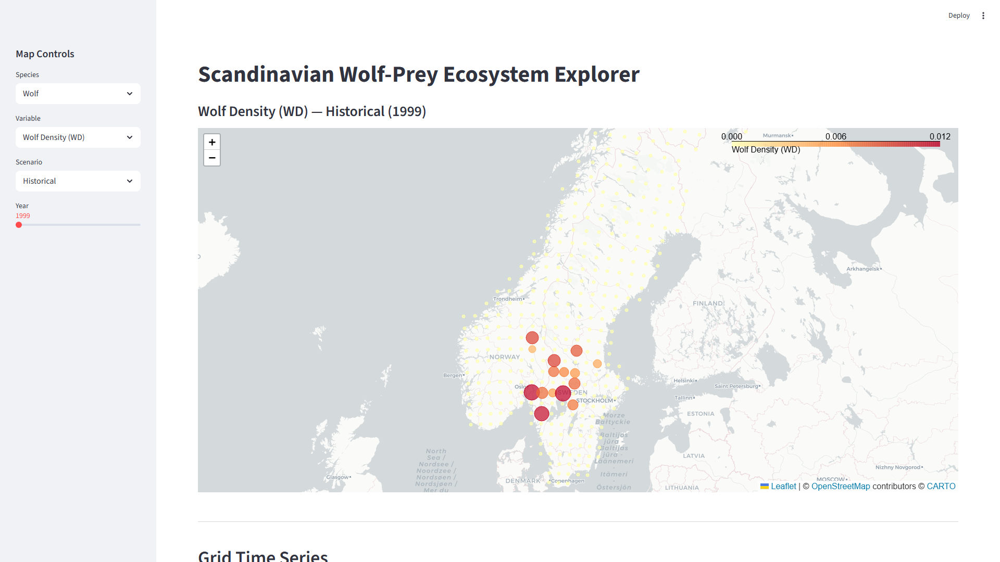
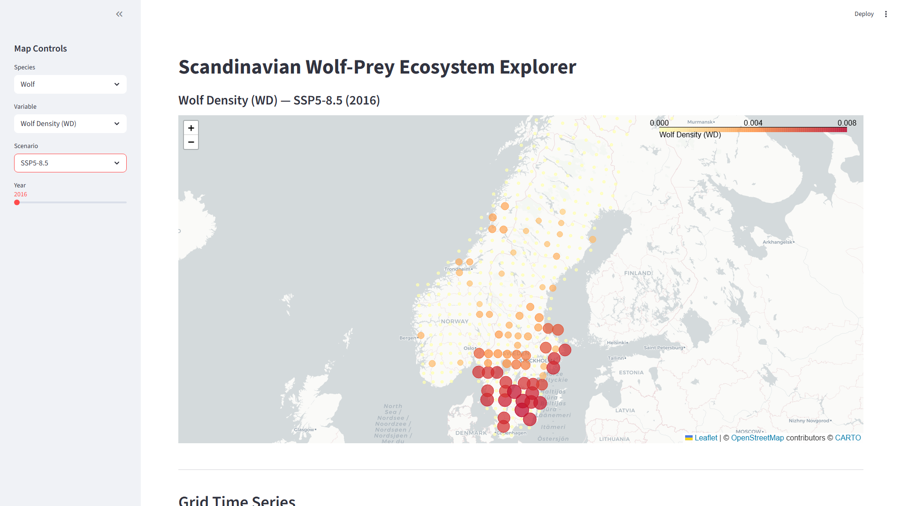
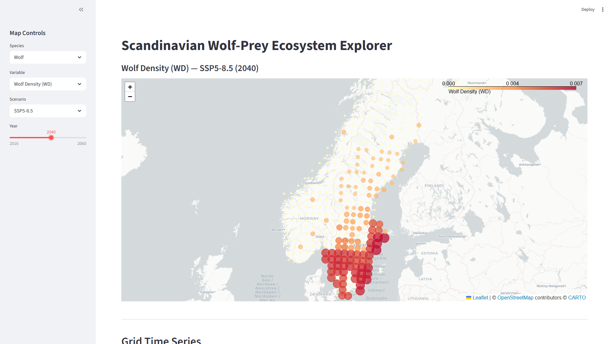
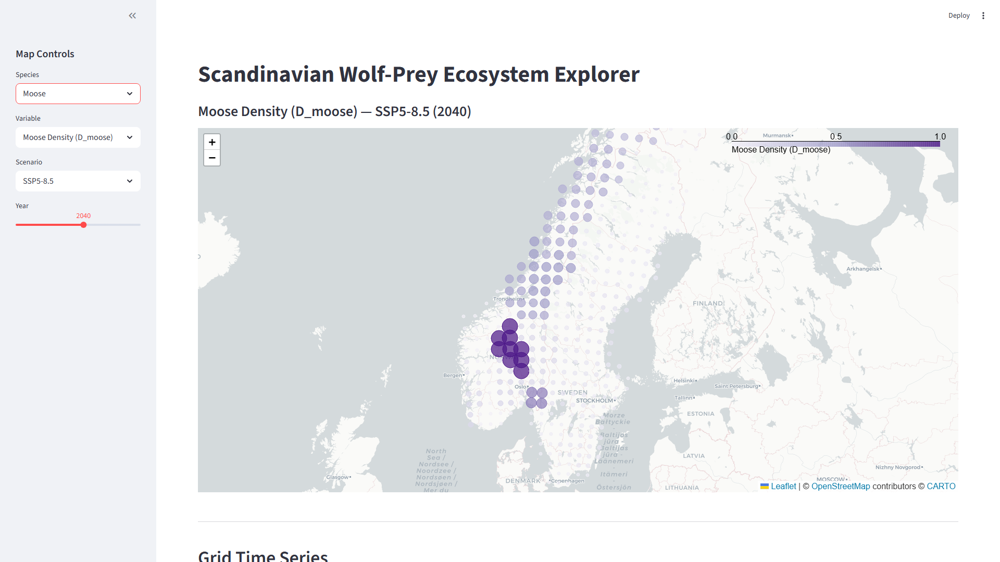
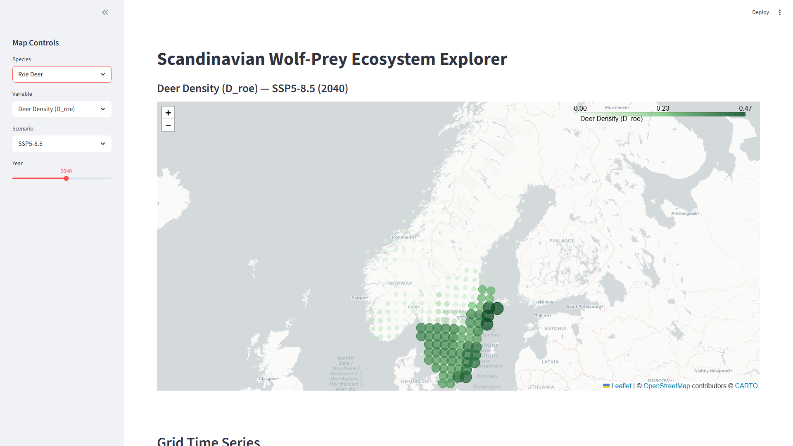

# Scandinavian Wolf-Prey Ecosystem Explorer — User Guide

## Introduction

The **Scandinavian Wolf-Prey Ecosystem Explorer** is an interactive web application that visualises wolf, roe deer, and moose population projections across Scandinavian grid cells from 1999 to 2060. It is designed for ecology researchers, wildlife managers, and anyone interested in understanding how climate scenarios may shape predator-prey dynamics in Scandinavia.

With this app you can answer questions such as:

- How does wolf density change under different climate pathways?
- Which regions are projected to support the highest moose populations by mid-century?
- How does the wolf range shift geographically over time?

---

## Prerequisites & Installation

| Requirement | Version |
|---|---|
| Python | 3.9 or later |
| Operating system | Windows, macOS, or Linux |

### Required packages

```
streamlit
folium
streamlit-folium
pandas
pyarrow
plotly
branca
numpy
```

### Install

From the project root directory:

```bash
pip install -r requirements.txt
```

Or install individually:

```bash
pip install streamlit folium streamlit-folium pandas pyarrow plotly branca numpy
```

---

## How to Launch the App

Open a terminal in the project root and run:

```bash
streamlit run src/app/wolf_map.py
```

The app will open automatically in your default browser at **http://localhost:8501**.

> **Port already in use?** If port 8501 is busy, Streamlit will suggest an alternative (e.g. 8502). You can also force a specific port with `streamlit run src/app/wolf_map.py --server.port 8505`.

---

## App Overview



The app has two main areas:

- **Sidebar (left)** — All controls for selecting species, variable, climate scenario, and year.
- **Map (centre)** — An interactive choropleth map of Scandinavia. Each circle marker represents one grid cell; colour and size encode the selected variable's value.

Below the map is a **Grid Time Series** section that shows how all variables evolve over time for a selected grid cell.

---

## Using the Controls

### Scenario Selector



Choose which climate scenario to display on the map. Available options:

| Scenario | Description |
|---|---|
| **Historical** | Observed data from 1999 to 2015. |
| **SSP1-1.9** | Very aggressive mitigation; warming held to ~1.5 C. |
| **SSP1-2.6** | Strong mitigation; warming limited to ~2 C. |
| **SSP2-4.5** | Middle-of-the-road pathway; moderate emissions. |
| **SSP3-7.0** | Regional rivalry; high emissions and slow mitigation. |
| **SSP5-8.5** | Fossil-fuel intensive; highest warming trajectory. |

Switching scenarios changes both the map data and the year range available on the slider.

### Year Slider



Drag the slider to move through time. The available range depends on the selected scenario:

- **Historical**: 1999 -- 2015
- **Any SSP scenario**: 2016 -- 2060

The map updates immediately when you move the slider, letting you watch spatial patterns evolve year by year.

### Species & Variable Selector



First choose a **Species** (Wolf, Roe Deer, or Moose), then pick a **Variable** within that species:

**Wolf variables:**
- Wolf Density (WD) — wolves per grid cell
- Pack Size (WP_total) — total wolves in packs
- Territory Number (NT) — number of established territories
- Territory Size (mean_ST) — average territory area
- Solitary Wolves (W_solitary) — lone wolves outside packs
- Predicted Wolf Density — model-predicted density for app display

**Roe Deer variables:**
- Deer Density (D_roe) — roe deer per grid cell
- Habitat Suitability (H) — habitat quality index
- Predicted Roe Deer Density — model-predicted density

**Moose variables:**
- Moose Density (D_moose) — moose per grid cell
- Habitat Suitability (H) — habitat quality index
- Predicted Moose Density — model-predicted density

Each species uses a distinct colour palette: yellow-red for wolves, greens for roe deer, and blue-purple for moose.


---

## Reading the Map

- **Colour and size** both encode the variable value. Darker/larger circles indicate higher values; lighter/smaller circles indicate lower values.
- **Colour scale legend** appears in the bottom-right corner of the map, labelled with the selected variable name and showing the min-to-max range.
- **Hover** over any circle marker to see a tooltip with the grid ID, county, country, variable value, and year.
- **Zoom and pan** using your mouse scroll wheel (or pinch gestures on a trackpad) and click-and-drag.
- **Zero-value cells** appear as the lightest colour at minimum size. If a grid cell has no data for a given scenario/year combination, it will not appear on the map.

---

## Grid Time Series



Below the map, the **Grid Time Series** section shows how all variables evolve over the full 1999--2060 period for a single grid cell.

### Selecting a grid

- **Click a marker** on the map — the nearest grid is automatically selected.
- **Manual dropdown** — use the "Or select Grid ID manually" dropdown to pick any grid by its numeric ID.

### Reading the charts

The time series panel contains three chart groups arranged in columns:

1. **Wolf Variables** — Wolf Density, Pack Size, Territory Number, Territory Size
2. **Deer & Habitat Variables** — Roe Deer Density, Moose Density, Habitat Suitability
3. **Predicted Densities** — Predicted Wolf, Roe Deer, and Moose Density

Each chart shows:

- A solid dark line for the **Historical** period (1999--2015)
- Dashed coloured lines for each **SSP projection** (2016--2060)
- A vertical dotted grey line at **2015** marking the boundary between observed and projected data

---

## Example Workflows

### 1. Compare wolf density in 2020 vs 2050 under SSP5-8.5

1. Select **Wolf** as the species and **Wolf Density (WD)** as the variable.
2. Choose **SSP5-8.5** as the scenario.
3. Set the year slider to **2020** and note the spatial pattern and colour intensities.
4. Move the slider to **2050** and observe how the density distribution changes.

### 2. Find which grids have highest moose density under SSP1-1.9

1. Select **Moose** and **Moose Density (D_moose)**.
2. Choose **SSP1-1.9** and set the year slider to **2060**.
3. Look for the darkest purple circles — hover over them to read their grid IDs, counties, and exact density values.

### 3. Explore how the wolf range shifts northward over time

1. Select **Wolf** and **Wolf Density (WD)**.
2. Choose **SSP5-8.5** (the most dramatic warming pathway).
3. Start the slider at **2016** and slowly scrub forward to **2060**, watching whether occupied cells appear at higher latitudes over time.
4. Click on a northern grid cell to open its time series and confirm when wolves first appear in that location.

---

## Troubleshooting / FAQ

**The app won't start.**
Make sure all required packages are installed. Run `pip install streamlit folium streamlit-folium pandas pyarrow plotly branca numpy`. Also verify that the data file `src/app/map_data.parquet` exists — if not, run `python src/app/build_map_data.py` first.

**The map is blank or shows no markers.**
Check that you have a valid scenario/year combination. The Historical scenario only covers 1999--2015; SSP scenarios cover 2016--2060. If the data file is incomplete, regenerate it with `python src/app/build_map_data.py`.

**The app is slow to load.**
The first load caches the Parquet data file. Subsequent interactions within the same session should be faster. If the data file is very large, ensure you have at least 1 GB of free RAM.

**Time series charts are empty for a grid.**
Not all grid cells have data for every scenario. Coastal or island grids may have been excluded during preprocessing.

**Port conflict.**
Use `streamlit run src/app/wolf_map.py --server.port <PORT>` to specify an alternative port.

---

## Data Sources

All data displayed in this app comes from the project's simulation and preprocessing pipeline:

- **Wolf population variables** — outputs from the wolf territory and population simulation model (`results/simulation/`).
- **Roe deer and moose densities** — derived from the preprocessing pipeline (`results/preprocessing/`) with projected values extended to 2060.
- **Predicted densities** — assembled by `src/utils/assemble_predictions.py` from the simulation outputs, applying island and urban area filters.
- **Grid geometry** — centroid coordinates, county, and country metadata from the base grid dataset.

The consolidated data file (`src/app/map_data.parquet`) is built by `src/app/build_map_data.py`, which merges all sources into a single file for fast loading.
